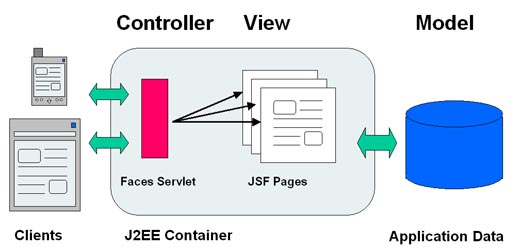
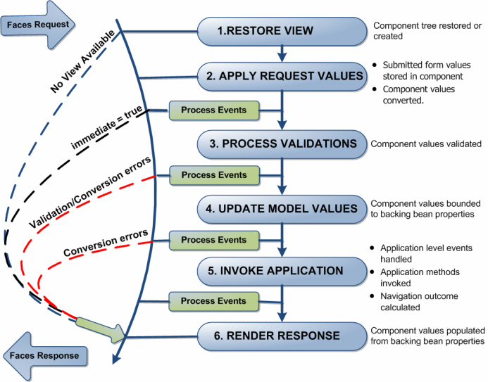
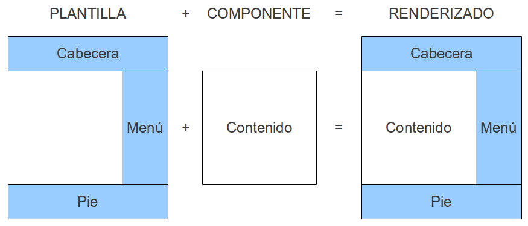

% JSF
% Adolfo Sanz De Diego
% Mayo 2012

# Creditos

## Pronoide

- Pronoide consolida sus servicios de formación superando
  las **22.000 horas impartidas** en más de 500 cursos (Diciembre 2011)

- En la vorágine de **tecnologías y marcos de trabajo existentes
  para la plataforma Java**, una empresa dedica demasiado esfuerzo en
  analizar, comparar y finalmente decidir cuáles son los
  pilares sobre los que construir sus proyectos.

- Nuestros Servicios de Formación Java permiten ayudarle en esta tarea,
  transfiriéndoles nuestra **experiencia real de más de 10 años**.

## Autor

- **Adolfo Sanz De Diego**
    - Correo: [asanzdiego@gmail.com](mailto:asanzdiego@gmail.com)
    - Twitter: [@asanzdiego](http://twitter.com/asanzdiego)
    - Blog: [http://asanzdiego.blogspot.com.es](http://asanzdiego.blogspot.com.es)

## Licencia

- **Este obra está bajo una licencia:**
    - [Creative Commons Reconocimiento-CompartirIgual 3.0](http://creativecommons.org/licenses/by-sa/3.0/es/)

# Introducción

## Objetivo

- El objetivo de JSF es **desarrollar aplicaciones web** de forma parecida
  a como se construyen **aplicaciones de escritorio** con Swing, AWT, SWT.

- JSF gestiona las acciones producidas por el usuario en su página HTML,
  las traduce a **eventos que son enviados al servidor**,
  y regenera la página original con los cambios provocados por dichas acciones.

## Características

- Con JSF podremos:
    - Representar componentes de interfaz de usuario y manejar su estado.
    - Manejar eventos.
    - Validar y convertir datos.
    - Definir la navegación entre páginas.
    - Soportar internacionalización.
    - Soportar AJAX.
    - Extender todas estas características.

## Estándar

- Desde la JCP (**Java Community Process**) han sacado varios JSR (**Java Specification Requests**)

    - [JSR 127 para JSF 1.0 y 1.1](http://www.jcp.org/en/jsr/detail?id=127)
    - [JSR 252 para JSF 1.2](http://www.jcp.org/en/jsr/detail?id=252)
    - [JSR 314 para JSF 2.0](http://www.jcp.org/en/jsr/detail?id=314)

## Novedades JSF 2.0

- Facelets (mecanismo de plantillas).
- Soporte nativo Ajax.
- Navegación implicita (convención sobre configuración).
- Navegación condicional.
- Nuevo scope view.
- Uso intensivo de anotaciones.
- Project Stage (etapa del proyecto: desarrollo, producción, etc.)
- Mejora de la validación.
- Mejora la gestión de errores.
- Añadido ResourceBundles como bean.
- Carga de recursos (imágenes, CSS, JavaScripts...)
- Componentes compuestos

## Implementaciones y extensiones

## Model-View-Controller

## Arquitectura

- Clases Java:
    - Componentes UI
        - estándares: botón, checkbox, label, etc.
        - personalizados: ya sean de librerías externas o propios.
    - FacesServlet (Front Controler declarado en el web.xml)
    - Conversores de tipo
    - Validadores

- Tags Libraries:
    - Estándares -> [http://horstmann.com/corejsf/jsf-tags.html](http://horstmann.com/corejsf/jsf-tags.html)
    - Personalidadas.
    - Usadas en JSP y Facelets.

- Archivos de configuración (faces-config.xml):
    - Define ManagedBeans.
    - Define la navegación entre páginas.

# Configuración

## Dependencias

- jsf-api.jar

- jsf-impl.jar

## FacesServlet en el web.xml

~~~{.xml}
<!-- Paginas de bienvenida -->
<welcome-file-list>
  <welcome-file>faces/index.xhtml</welcome-file>
</welcome-file-list>

<!-- Definición de Faces Servlet -->
<servlet>
  <servlet-name>Faces Servlet</servlet-name>
  <servlet-class>javax.faces.webapp.FacesServlet</servlet-class>
  <load-on-startup>1</load-on-startup>
</servlet>

<!-- Mapeos de Faces Servlet -->
  <servlet-mapping>
  <servlet-name>Faces Servlet</servlet-name>
  <url-pattern>/faces/*</url-pattern>
</servlet-mapping>
~~~

## Project Stage en el web.xml

- Sirve para indicar el **modo de trabajo**.

- Dependiendo del modo se mostrarán más o menos mensajes de error.

- Hay 5: Production, Development, UnitTest, SystemTest y Extension.

~~~{.xml}
<!-- Cambiar a "Production" cuando la aplicación esté lista -->
<context-param>
  <param-name>javax.faces.PROJECT_STAGE</param-name>
  <param-value>Development</param-value>
</context-param>
~~~

# ManagedBeans

## Declaración

- Un ManagedBean es simplemente un POJO.

- Se pueden configurar mediante **anotaciones** o en **/WEB-INF/faces-config.xml**

~~~{.java}
@ManagedBean(name="holaBean")
@SessionScoped
public class HolaBean implements Serializable {

  private String nombre;

  public holaBean() { }

  // getters y setters
}
~~~

~~~{.xml}
<managed-bean>
  <managed-bean-name>holaBean</managed-bean-name>
  <managed-bean-class>mipaquete.HolaBean</managed-bean-class>
  <managed-bean-scope>session</managed-bean->
</managed-bean>
~~~

## Inicializar propiedades

- En \<value> podemos hacer referencia a otro bean con expresiones
  del tipo #{otroBean.otraPropiedad}.

~~~{.java}
@ManagedBean
@SessionScoped
public class UserBean {
  @ManagedProperty(value="Ana")
  private String name
  ...
}
~~~

~~~{.xml}
<managed-bean>
  <managed-bean-name>userBean</managed-bean-name>
  <managed-bean-class>com.examples.UserBean</managed-bean-class>
  <managed-bean-scope>session</managed-bean-scope>
  <managed-property>
    <property-name>name</property-name>
    <value>Ana</value>
  </managed-property>
</managed-bean>
~~~

## Inicializar un array o un List

- Sólo desde faces-config.xml

~~~{.xml}
<managed-property>
  <property-name>colores</property-name>
  <list-entries>
    <value>Rojo</value>
    <value>Verde</value>
    <value>Amarillo</value>
  </list-entries>
</managed-property>
~~~

~~~{.xml}
<managed-property>
  <property-name>numHabitaciones</property-name>
  <list-entries>
    <value-class>java.lang.Integer</value-class>
    <value>1</value>
    <value>2</value>
    <value>3</value>
  </list-entries>
</managed-property>
~~~

- Para acceder desde nuestra página JSF:

~~~{.xml}
<h:outputText value="#{userBean.colores[2]}"/>
~~~

## Inicializar un Map

- Sólo desde faces-config.xml

~~~{.xml}
<managed-property>
  <property-name>semaforo</property-name>
  <map-entries>
    <map-entry>
      <key>Rojo</key>
      <value>No puedes continuar</value>
    </map-entry>
    <map-entry>
      <key>Verde</key>
      <value>Puedes continuar</value>
    </map-entry>
  </map-entries>
</managed-property>
~~~

~~~{.xml}
<map-entries>
  <key-class>java.lang.Integer</key-class>
  <map-entry>
    <key>1</key>
    ...
</map-entries>
~~~

- Para acceder desde nuestra página JSF:

~~~{.xml}
<h:outputText value="#{userBean.semaforo['Verde']}"/>
~~~

## Utilizar un List como Bean

~~~{.xml}
<managed-bean>
  <managed-bean-name>colores</managed-bean-name>
  <managed-bean-class>java.util.ArrayList</managed-bean-class>
  <managed-bean-scope>none</managed-bean-scope>
  <list-entries>
    <value>Rojo</value>
    <value>Amarillo</value>
    <value>Verde</value>
  </list-entries>
</managed-bean>
~~~

## Utilizar un Map como Bean

~~~{.xml}
<managed-bean>
  <managed-bean-name>semaforo</managed-bean-name>
  <managed-bean-class>java.util.HashMap</managed-bean-class>
  <managed-bean-scope>none</managed-bean-scope>
  <map-entries>
    <map-entry>
      <key>Rojo</key>
      <value>No puedes continuar</value>
    </map-entry>
    <map-entry>
      <key>Verde</key>
      <value>Puedes continuar</value>
    </map-entry>
  </map-entries>
</managed-bean>
~~~

# Expression Language

## Acceder a las propiedades

- Expression Language (EL) nos permite acceder a las propiedades y a los métodos de los beans.

~~~{.XML}
<h:outputText value="#{userBean.profile}""/>
~~~

- Podemos utilizar operadores aritméticos, relacionales, lógicos, ternarios o comprobar si el valor es empty.

~~~{.XML}
<h:outputText rendered="#{userBean.profile=='VIP'}" value="Bono regalo de #{bono.base-10} Euros"/>
~~~

- Podemos invocar a métodos con parámetros, siempre que no estén sobrecargados.

~~~{.XML}
<h:commandButton value="Aceptar" action="#{userBean.addText('texto')}"/>
~~~

## Acceder a las propiedades desde Java

~~~{.java}
FacesContext ctx = FacesContext.getCurrentInstance();
Application app = ctx.getApplication( );
~~~

~~~{.java}
ELContext ec = ctx.getELContext( );
String name = (String) app.evaluateValueExpressionGet(ctx,"#{userBean.name}",String.class);
~~~

~~~{.java}
ExpressionFactory ef = app.getExpressionFactory( );
ValueExpression ve =.ef.createValueExpression(ec,"#{userBean.name}",String.class);
name = (String) ve.getValue(ec);
ve.setValue(ec, "Serena");
~~~

~~~{.java}
ExpressionFactory ef = app.getExpressionFactory( );
ValueExpression ve = ef.createValueExpression(ec,"#{userBean}",UserBean.class);
UserBean ub = (UserBean) ve.getValue(ec);
ub.setName("Serena");
~~~

## Objectos implícitos

- Son unos objetos que ya vienen predefinidos:

    - **#{component}**: el UIComponent actual.
    - **#{facesContext}**: el FacesContext actual.
    - **#{view}**: el UIViewRoot actual.
    - **#{request}**: el HttpServletRequest actual.
    - **#{session}**: el HttpSession actual.
    - **#{application}**: el ServletContext.
    - **#{flash}**: el Flash, que es un Map.
    - **#{cc}**: el Composite Component.
    - **#{requestScope}**: un map con los atributos de la request actual.
    - **#{viewScope}**: un map con los atributos de la view actual.
    - **#{sessionScope}**: un map con los atributos de la session actual.
    - **#{applicationScope}**: un map con los atributos del scope aplication actual.
    - **#{initParam}**: un map con los parámetros del context actual.
    - **#{param}**: un map con los parámetros de la request actual.
    - **#{paramValues}**: un map con los valores de los parámetros de la request actual.
    - **#{header}**: un map con la cabecera de la request actual.
    - **#{headerValues}**: un map con los valores de la cabecera de la request actual.
    - **#{cookie}**: un map con los atributos de la cookie.

# Bean Scopes

## Definición

- Un scope es un mapeo entre nombres y objetos que se almacena durante un determinado periodo de tiempo.

- Como buenas prácticas, se recomienda utilizar siempre el menor scope que necesite el bean,
  para evitar así posibles problemas de memoria al tener que almacenar más información de la necesaria.

- Si declaramos el bean desde el fichero faces-config.xml

~~~
<managed-bean-scope>application|session|view|request|none|custom</managed-bean-scope>
~~~

- Si queremos hacerlo con anotaciones:

~~~{.java}
@{Application|Session|View|Request|None|Custom}Scoped
~~~

## Application

- Con este scope, se guarda la información durante **toda la vida de la aplicación web**,
  independientemente de todas las peticiones y sesiones que se realicen.

- Este bean se instancia con la primera petición a la aplicación
  y desaparece cuando la aplicación web se elimina del servidor.

- Si queremos que el bean se instancie antes de que se muestre la primera página
  de la aplicación, usamos la propiedad eager a true.

~~~{.xml}
<managed-bean eager="true">
~~~

~~~{.java}
@ManagedBean(eager=true)
~~~

## Session

- Este scope guarda la información **desde que el usuario comienza una sesión hasta
  que ésta termina** (porque el tiempo expiró o se invocó al método invalidate
  sobre un objeto HttpSession).

- HTTP es un protocolo sin estado, y por tanto, una vez que se envía
  una petición al servidor y éste responde, no se guarda ninguna información
  sobre esta transición.

- Esto no es siempre adecuado en aplicaciones de lado de servidor,
  ya que es normal que necesiten ir guardando el estado.

- Para ello, podemos utilizar:

    - **Cookies**: pares nombre-valor que el servidor envía al usuario,
      confiando en que en posteriores peticiones se la vaya "devolviendo".
    - **URL rewriting**: añade un identificador de sesión a la URL,
      y la sesión se guarda en el servidor.

## View

- Este scope **dura desde que se muestra una página JSF al usuario
  hasta que el usuario navega hacia otra página**.

- Es muy útil para páginas que usan **AJAX**.

## Request

- Este scope dura lo que **dura una petición request**.

- Comienza cuando se envía una petición al servidor
  y termina cuando se devuelve la respuesta al usuario.

- Esto hace que se cree una instancia del bean asociado para cada petición.

- Los mensajes de estado y de error que se muestran al usuario
  son buenos candidatos a ser request, ya que se muestran una vez
  que el servidor devuelve la respuesta.

## None

- Los beans se instancian cuando son necesitados por otros beans,
  y se eliminan cuando esta necesidad desaparece.

## Custom

- También se permite crear scopes personalizados donde el tiempo que dura
  lo definimos nosotros.

- La aplicación se vuelve responsable de ir eliminando las instancias de los beans del mapeo.

# Ciclo de vida

## Una petición

- El ciclo de vida de JSF comienza cuando un usuario hace una petición HTTP
  y termina cuando el servidor le responde con la página correspondiente.

- Como HTTP es un protocolo sin estado, no es capaz de "recordar"
  las transacciones anteriores que se han llevado a cabo entre el usuario y el servidor.

- JSF soluciona esta "falta de memoria" manteniendo vistas en el lado del servidor.

- Una vista es un árbol de componentes que representa la UI del usuario.

## Esquema

## Restore View

- Se crea o restaura el árbol de componentes (la vista) en memoria.

- Cuando la vista se crea por primera vez, se almacena en un contenedor padre
  conocido como FacesContext, y se pasa directamente a la última fase (Render Response),
  ya que la petición no tendrá valores que estudiar.

- Todas las operaciones realizadas en el FacesContext utilizan
  un hilo por petición de usuario, así que no hay que preocuparse
  porque múltiples peticiones de usuarios puedan "liarla".

## Apply Request Values

- Se itera sobre los componentes del árbol, comprobando qué valor de la petición
  pertenece a qué componente, y los van guardando.

- Aquí es donde se hace la conversión de datos de texto a objetos.

- Estos valores almacenados se llaman "valores locales".

## Process Validations

- Se realizan las validaciones necesarias de los "valores locales".

- Si ocurre algún error en esta fase, se pasa a la fase Render Response,
  mostrándole al usuario otra vez la página actual con los errores ocurridos,
  dándole así una nueva oportunidad para que pueda introducir los datos correctos.

- Si añadimos a un botón o a un link el atributo immediate=true,
  se saltará la fase de validación.

## Update Model Values

- Se modifican los valores de los bakings beans asociados a los componentes
  de la vista con los "valores locales" (Ej. #{userBean.name})

- En esta fase es donde se hace la conversión de valores.

## Invoke Application

- Se invoca el método asociado al action del botón o del link que pinchó el usuario
  (Ej. #{userBean.addUser}), y que hizo que se activara el ciclo de vida de la petición.

- Estos métodos devuelven un String que le indica al gestor de navegación
  qué página tiene que devolverle al usuario.

## Render Response

- El servidor devuelve la página de respuesta al navegador del usuario
  y guarda el estado actual de la vista para poder restaurarla en una petición posterior.

- Aquí es donde se hace la conversión de datos de objetos a textos.

# Convertidores

## Descripción

- Convierte texto en un objeto y viceversa.

- Si hay un problema de formato lanza un excepción.

- Existen convertidores estándar pero también se pueden personalizar.

~~~{.xml}
<h:outputText value="#{myBean.date}" converter="myConverter">
~~~

~~~{.xml}
<h:outputText value="#{myBean.date}">
  <f:converter converterId="myConverter"/>
</h:outputText>
~~~

## Convertidores estándar

- Si no se especifica un convertidor, JSF escoge uno por defecto.

- Exsisten para todos los tipos básicos: Long, Byte, Integer, Short,
  Character, Double, Float, BigDecimal, BigInteger y Boolean.

- Existen además convertidores predefinidos para fechas y números.

## Convertidor DateTime

~~~{.xml}
<h:outputText value="#{myBean.date}">
  <f:convertDateTime type="date" dateStyle="medium"/>
</h:outputText>
~~~

- Atributos:
    - **dateStyle**: formato short, medium (por defecto), long y full, para la fecha.
    - **timeStyle**: formato short, medium (por defecto), long y full, para las horas, minutos y segudos.
    - **timezone**: zona horaria para la fecha.
    - **locale**: el idioma local a utilizar para la visualización de esta fecha.
    - **pattern**: permite utilizar un formato personalizado.
    - **type**: especifica si se debe mostrar la fecha (date), la hora (time) o ambas (both).

## Convertidor de Número

~~~{.xml}
<h:outputText value="#{myBean.number}">
  <f:convertNumber type="number" minFractionDigits="2" maxFractionDigits="2"/>
</h: outputText>
~~~

~~~{.xml}
<h:outputText value="#{myBean.currency}">
  <f:convertNumber type="currency" currencyCode="USD" currencySymbol="$"/>
</h: outputText>
~~~

- Atributos:
    - **currencyCode**: código internacional de la moneda.
    - **currencySymbol**: símbolo de la moneda
    - **groupingUsed**: si true (por defecto) mostrará separador de miles.
    - **integerOnly**: si true solo se procesa la parte entera ignorando decimales. Por defecto es false.
    - **locale**: el idioma local a utilizar para la visualización de este número.
    - **minFractionDigits**: cantidad mínima de decimales a mostrar.
    - **maxFractionDigits**: máximo número de decimales a mostrar.
    - **minIntegerDigits**: cantidad mínima de dígitos enteros a mostrar.
    - **maxIntegerDigits**: máximo número de dígitos enteros a mostrar.
    - **pattern**: permite utilizar un formato personalizado.
    - **tipo**: indica si es un número (number, por defecto),
      una moneda (currency), o un tanto por ciento (percent).

## Convertidores personalizados

- A veces, los convertidores estándar no son suficientes.

- Implementar la interfaz **javax.faces.Converter**.

- Durante el Apply Request Values, JSF utiliza **getAsObject()** para convertir
  la cadena de entrada al modelo de objetos de datos.

- Durante Render Response, JSF utiliza **getAsString()** para hacer la conversión
  en la dirección opuesta.

- Una vez finalizado el conversor, tiene que registrarse en faces-config.xml
  o usando la notación @FacesConverter.

~~~{.xml}
<converter>
  <converter-id>CCNumberConverter</converter-id>
  <converter-class>mipaquete.CCNumberConverter</converter-class>
</converter>
~~~

## Ejemplo

- Convertidor que limpia un número de tarjeta de cualquier carácter no numérico.

~~~{.java}
@FacesConverter(value="CCNumberConverter")
public class CCNumberConverter implements Converter {

  public Object getAsObject(
      FacesContext ctx, UIComponent cmp, String val) {

    Integer result = null;
    // parseamos val
    ...
    return result;
  }

  public String getAsString(
      FacesContext ctx, UIComponent cmp, Object val) throws ConverterException {

    String result = null;
    // parseamos val
    ...
    return result;
  }
}
~~~

~~~{.xml}
<h:inputText value="#{usuario.ccnumber}" converter="CCNumberConverter" />
~~~

# Validadores

## Definición

- Sirven para validar los datos introducidos por el usario.

- JSF viene con validadores estándar.

- Podemos crearnos validadores personalizados.

- Tabién podemos validar a nivel de aplicación.

## Validadores estándar

-**\<f:validateDoubleRange>**: valida que un double esté dentro de un rango determinado.
-**\<f:validateLength**: valida que la longitud de la cadena esté dentro de un rango determinado.
-**\<f:validateLongRange**: valida que un long esté dentro de un rango determinado.

~~~{.xml}
<h:inputText id="quantity" value="#{item.quantity}" size="2" required="true"
    requiredMessage="Cuantos? Ninguno?"
    converterMessage="Un entero por favor!"
    validatorMessage="Mínimo uno!">
  <f:validateLongRange minimum="1"/>
</h:inputText>
~~~

## Validadores personalizados

- Implementar la interfaz **javax.faces.validator.Validator**.

- Durante el Process Validations, JSF utiliza **validate()** para validar los
  datos introducidos.

- Una vez finalizado el conversor, tiene que registrarse en faces-config.xml
  o usando la notación @FacesValidator.

~~~{.xml}
<validator>
  <validator-id>CCExpiryValidator</validator-id>
  <validator-class>mipaquete.CCExpiryValidator</validator-class>
</validator>
~~~

## Ejemplo

- Validador que valida la fecha de expiración de una tarjeta de crédito:

~~~{.java}
@FacesValidator("CCExpiryValidator")
public class CCExpiryValidator implements Validator {

  public void validate(FacesContext context, UIComponent component, Object value) {

    String errorMessage = null;
    // validate value and put errorMessage
    ...
    if (message != null) {

      FacesMessage message = new FacesMessage(
          FacesMessage.SEVERITY_ERROR, errorMessage, errorMessage);
      throw new ValidatorException(message);
    }
  }
}
~~~

~~~{.xml}
<h:inputText id="ccexpiry" value="#{usuario.ccexpiry}"
    rendered="true"
    requiredMessage="No puede estar vacio">
  <f:validator validatorId="CCExpiryValidator" />
</h:inputText>
<h:message for="ccexpiry" errorClass="error" />
~~~

## Validador en Backing Bean

- En lugar de crear una nueva clase como se describe en la sección anterior,
  podemos agregar un método a un Backing Bean.

~~~{.java}
public class Usuario {

  ...

  public void validateCCExpiry(FacesContext context, UIComponent component, Object value) {

    String errorMessage = null;
    // validate value and put errorMessage
    ...
    if (errorMessage != null) {

       ((UIInput)component).setValid(false);

        FacesMessage message = new FacesMessage(errorMessage);
        context.addMessage(component.getClientId(context), message);
    }
  }
}
~~~

~~~{.xml}
<h:inputText id="ccexpiry" value="#{Usuario.apellido}"
    rendered="true" requiredMessage="No puede estar vacio"
    validator="#{usuario.validateCCExpiry}">
</h:inputText>
<h:message for="ccexpiry" errorClass="error" />
~~~

## Validación a nivel de aplicación

- Cuando queremos por ejemplo que un determinado registro exsista en la BD.

- Se hace en la llamada al método del Backing Bean, y si hay un error se muestra:

~~~{.java}
FacesContext context = FacesContext.getCurrentInstance();
FacesMessage message = new FacesMessage();
message.setSeverity(FacesMessage.SEVERITY_ERROR);
message.setSummary("Este es el mensaje de error principal");
message.setDetail("Este es el detalle");
context.addMessage(null, message);
~~~

~~~{.xml}
<h:messages globalOnly="true" styleClass="error"/>
~~~

# Navegación

## Navegación implícita

- Convención sobre configuración -> no requiere faces-config.xml.

- Si queremos navegar desde question1.xhtml a question2.xhtml, en un link:

~~~{.xml}
<h:commandLink value="Next" action="question2"/>
~~~

- Si queremos elegir la página en tiempo de ejecución,
  asociamos el action a un método que nos devuelva el String
  que indicará la siguiente página a mostrar.

~~~{.xml}
<h:commandButton label="Aceptar" action"#{userBean.login}"/>
~~~

~~~{.java}
public String login() {
  return "login";
}
~~~

## Navegación condicional

- En este caso si que hay que modificar faces-config.xml.

~~~{.xml}
<navigation-case>
   <from-action>#{admin.buyStock}</from-action>
   <if>#{user.admin == "administrador"}</if>
   <to-view-id>/order.xhtml</to-view-id>
</navigation-case>
~~~

## Peticiones HTTP GET

- Usar los componentes **\<h:button>** y **\<h:link>**
  en vez de \<h:commandButton> y \<h:commandLink>

~~~{.xml}
<h:link value="Aceptar" outcome="login?myname=Ana"/>
~~~

- Si queremos recoger los parámetros y asociarlos a un Bean, añadiremos al principio:

~~~{.xml}
<f:metadata>
<f:viewParam name="myname" value="#{userBean.name}"/>
</f:metadata>
<h:head>
...
~~~

- Si queremos incluir todos los parámetros definidos en la página JSF:

~~~{.xml}
<h:button value="Aceptar" outcome="login?includeViewParams=true"/>
~~~

# Tags Libraries

## Usos

- Las páginas JSF se construyen con librerías de etiquetas
  y con el **lenguaje de expresiones** EL (ej: \#{miBean.miPropiedad})

- Las librerías de etiquetas con **sus atributos permiten personalizar
  el aspecto y el comportamiento** de cada componente.

- Las librerías de etiquetas estándar son:
    - las **core tags libraries**: definen vistas, listeners, converters, validators, etc.
    - las **html tags libraries**: definen componentes de entrada, de salida,
      de acción, de selección, de agrupación

## Core: Vistas

- **\<f:view/>**: Crea una vista principal.
- **\<f:subview/>**: Crea una vista secundaria.
- **\<f:facet/>**: Añade un facet a un componente.

## Core: Listeners

- **\<f:actionListener/>**: Añade un ActionListener a un componente.
- **\<f:valueChangeListener/>**: Añade un ValueChangeListener a un componente.
- **\<f:setPropertyChangeListener/>**: Añade un ActionListener a un componente
  que establece una propiedad de un bean a un valor dado.

## Core: Converters

- **\<f:converter/>**: Añade un Converter a un componente.
- **\<f:convertDateTime/>**: Añade un DateTimeConverter a un componente.
- **\<f:convertNumber/>**: Añade un NumberConverter a un componente.

## Core: Validators

- **\<f:validator/>**: Añade un Validator a un componente.
- **\<f:validateDoubleRange/>**: Valida que el valor de un componente esté dentro de un rango de valores de tipo double.
- **\<f:validateLength/>**: Valida la longitud del texto de un componente.
- **\<f:validateLongRange/>**: Valida que el valor de un componente esté dentro de un rango de valores de tipo long.

## Core: Otros

- **\<f:attribute/>**: Añade un atributo (clave/valor) a un componente.
- **\<f:param/>**: Añade un parámetro a un componente.
- **\<f:loadBundle/>**: Carga un ResourceBundle y guarda las propiedades como un Map.
- **\<f:selectitems/>**: Specifica los items selcionados de un select.
- **\<f:selectitem/>**: Specifica el item selcionado de un select.
- **\<f:verbatim/>**: Añade etiquetas HTML dentro de una página JSF.

## HTML: Componentes de entrada

- **\<h:inputText/>**: Simple linea de texto de entrada.
- **\<h:inputTextarea/>**: Múltiples lineas de texto de entrada.
- **\<h:inputSecret/>**: Contraseña de entrada.
- **\<h:inputHidden/>**: Campo oculto.

## HTML: Componentes de salida

- **\<h:outputLabel/>**: Etiqueta para otro componente.
- **\<h:outputLink/>**: Enlace HTML.
- **\<h:outputFormat/>**: Formatea un texto de salida.
- **\<h:outputText/>**: Simple linea de texto de salida.
- **\<h:outputStylesheet/>**: Import de un CSS.
- **\<h:outputScript/>**: Import de un JavaSript.
- **\<h:graphicImage/>**: Muestra una imagen.
- **\<h:message/>**: Muestra el mensaje más reciente para un componente.
- **\<h:messages/>**: Muestra todos los mensajes.

## HTML: Componentes de acción

- **\<h:commandButton/>**: Botón: submit, reset o pushbutton.
- **\<h:commandLink/>**: Enlace asociado a un botón pushbutton.

## HTML: Componentes de selección

- **\<h:selecOneListbox/>**: Selección simple para lista desplegable.
- **\<h:selectOneMenu/>**: Selección simple para menu.
- **\<h:selectOneRadio/>**: Conjunto de botones radio.
- **\<h:selectBooleanCheckbox/>**: Checkbox.
- **\<h:selectManyCheckbox/>**: Conjunto de checkboxes.
- **\<h:selectManyListbox/>**: Selección múltiple de lista desplegable.
- **\<h:selectManyMenu/>**: Selección múltiple de menu.

## HTML: Componentes de agrupación

- **\<h:head/>**: Cabecera HTML.
- **\<h:body/>**: Cuerpo HTML.
- **\<h:form/>**: Formulario HTML.
- **\<h:panelGrid/>**: Tabla HTML.
- **\<h:panelGroup/>**: Dos o más componentes que son mostrados como uno.
- **\<h:dataTable/>**: Tabla de datos.
- **\<h:column/>**: Columna de un dataTable.

# Message Bundles

## Definición

- Los Message Bundles son ficheros .properties que guardan **mensajes del tipo clave=valor**.

- Nos ayuda con la internacionalización de la aplicación.

## Instanciación

- messages.properties en src/java/com/examples con dos mensajes:

    -name=Tu nombre:
    -age=Tu edad:

- Lo podemos definir en cada página JSF donde lo necesitemos

~~~{.xml}
<f:loadBundle basename="com.examples.messages" var="msgs"/>
~~~

- O de manera global en faces-config.xml

~~~{.xml}
<application>
  <resource-bundle>
    <base-name>com.examples.messages</base-name>
    <var>msg</var>
  </resource-bundle>
</application>
~~~

- Para acceder:

~~~{.xml}
#{msg.name}
~~~

## Paremetrización

~~~{.xml}
saludo=Bienvenido {0} a nuestra web
~~~

~~~{.xml}
<h:outputFormat value="#{msg.saludo}">
  <f:param value="#{userBean.name}"/>
</h:outputFormat>
~~~

## Internacionalización

- Crear un nuevo .properties anadiendo un guión bajo y el código ISO-639 del idioma:

~~~
messages_en.properties
~~~

- Java se encarga de hacer referencia al fichero adecuado según el idioma.

- Si no se carga ninguno, coge el de por defecto, que en nuestro ejemplo sería messages.properties.

## Definir el idioma de nuestra aplicación

- De manera global en el fichero faces-config.xml:

~~~{.xml}
<application>
  <locale-config>
    <default-locale>es</default-locale>
    <supported-locale>en</supported-locale>
  </locale-config>
</application>
~~~

- De manera local y estática en una página JSF:

~~~{.xml}
<f:view locale="en">
~~~

- De manera local y dinámica (por ejemplo, para cuando dejemos que el usuario seleccione el idioma)

~~~{.xml}
<f:view locale="#{userBean.locale}"/>
~~~

- De manera local en una clase Java

~~~{.java}
FacesContext.getCurrentInstance().getViewRoot().setLocale(new Locale("es"));
~~~

# Facelets

## Esquema

## Configuración web.xml

- Indicar que el sufijo por defecto de las páginas será .xhtml:

~~~{.xml}
<context-param>
  <param-name>javax.faces.DEFAULT_SUFFIX</param-name>
  <param-value>.xhtml</param-value>
</context-param>
~~~

## Opciones web.xml

- Parámetro opcional para indicar que estamos en desarrollo y que Facelets
  sea más informativo en los logs.

~~~{.xml}
<context-param>
  <param-name>facelets.DEVELOPMENT</param-name>
  <param-value>true</param-value>
</context-param>
~~~

- Otro parámetro opcional para que Facelets no procese los comentatios \<!-- -->

~~~{.xml}
<!-- Definir este parámetro es más cómodo y más visual que usar el <ui:remove> de Facelets. -->
<context-param>
  <description>Do not render comments in facelets (xhtml) pages. Default is false.</description>
  <param-name>javax.faces.FACELETS_SKIP_COMMENTS</param-name>
  <param-value>true</param-value>
</context-param>
~~~

## Configuración faces-config.xml

- Indicar que nuestra aplicación JSF va a utilizar Facelets como ViewHandler:

~~~{.xml}
<application>
  <view-handler>com.sun.facelets.FaceletViewHandler</view-handler>
</application>
~~~

## Tags

- **\<ui:insert>**: definición a remplazar en un componente mediante la etiqueta \<ui:define>.
- **\<ui:param>**: para pasar parámetros desde las plantillas a los componentes.
- **\<ui:composition>**: envuelve un conjunto de componentes que utilizan una plantilla. Todo lo que no esté dentro no se rederizará.
- **\<ui:define>**: contenido que remplaza lo definido en un \<ui:insert>.
- **\<ui:decorate>**: igual que la etiqueta \<ui:composition> sólo que ahora se renderiza todo.
- **\<ui:include>**: sirve para incluir en una página el contenido de otra.

## Definición de la Plantilla

- Dentro del directorio WEB-INF/facelets/templates/, de modo que no sean visibles desde el contenedor web.

- defaultLayout.xhtml

~~~{.xml}
<!--  -->
<?xml version="1.0" encoding="UTF-8"?>
<!DOCTYPE html PUBLIC "-//W3C//DTD XHTML 1.0 Transitional//EN" "http://www.w3.org/TR/xhtml1/DTD/xhtml1-transitional.dtd">
<html xmlns="http://www.w3.org/1999/xhtml" xmlns:ui="http://java.sun.com/jsf/facelets"
  xmlns:f="http://java.sun.com/jsf/core" xmlns:h="http://java.sun.com/jsf/html">

<h:head> ... <title><ui:insert name="title"/> ... </title>

<h:body>
  
 ... 

  
<ui:include src="menu.xhtml"/>

  

    <ui:insert name="content">
      Texto por defecto
    </ui:insert>
  

  
 ... 

</h:body>
</html>
~~~

## Inclusión del Menú

- menu.xhtml

~~~{.xml}
<?xml version="1.0" encoding="UTF-8"?>
<!DOCTYPE html PUBLIC "-//W3C//DTD XHTML 1.0 Transitional//EN" "http://www.w3.org/TR/xhtml1/DTD/xhtml1-transitional.dtd">
<html xmlns="http://www.w3.org/1999/xhtml" xmlns:ui="http://java.sun.com/jsf/facelets"
  xmlns:f="http://java.sun.com/jsf/core" xmlns:h="http://java.sun.com/jsf/html"
  xmlns:p="http://primefaces.prime.com.tr/ui">
  <ui:composition>
    <p:menubar>
      <p:submenu label="#{msg.menu_home}">
        <p:menuitem label="Home" url="#" />
      </p:submenu>
      <p:submenu label="#{msg.menu_items}">
        <p:menuitem label="#{msg.new}" url="#{menuBean.createItem}"></p:menuitem>
        <p:menuitem label="#{msg.list}" url="#{menuBean.listItem}"></p:menuitem>
      </p:submenu>
    </p:menubar>
  </ui:composition>
</html>
~~~

## Uso de la Plantilla

~~~{.xml}

<?xml version="1.0" encoding="UTF-8"?>
<!DOCTYPE html PUBLIC "-//W3C//DTD XHTML 1.0 Transitional//EN" "http://www.w3.org/TR/xhtml1/DTD/xhtml1-transitional.dtd">

<html xmlns="http://www.w3.org/1999/xhtml" xmlns:ui="http://java.sun.com/jsf/facelets"
    xmlns:f="http://java.sun.com/jsf/core" xmlns:h="http://java.sun.com/jsf/html">

<ui:composition template="/WEB-INF/facelets/templates/defaultLayout.xhtml">
  <ui:define name="title">
    <h:outputText value="#{msg.edit_of} #{msg.menu_items}" />
  </ui:define>
  <ui:define name="content">
    <h:form>
      <!-- contenido de la página-->
    </h:form>
  </ui:define>
</ui:composition>
</html>
~~~
